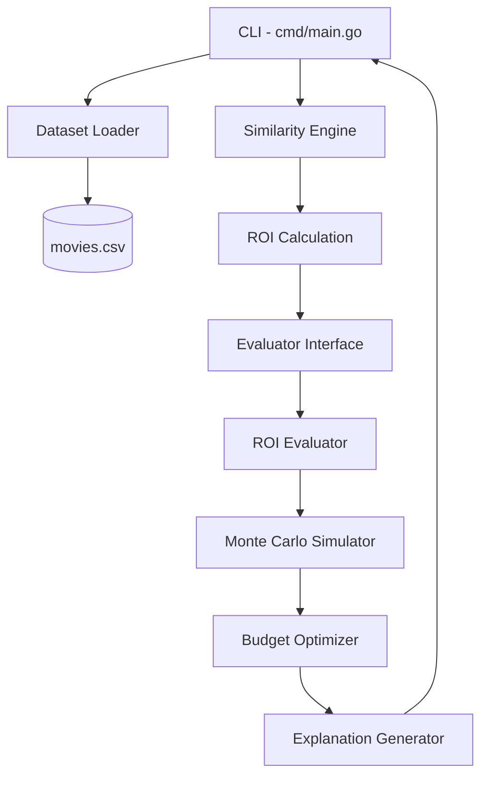

# Design Document: Content Investment Simulator

## Overview

The Content Investment Simulator is a Go CLI application that recommends optimal content investment budgets based on historical movie performance data. Given a free-text movie plot, the system identifies similar historical titles via keyword matching, computes ROI metrics, runs Monte Carlo simulations to model uncertainty, optimizes across candidate budgets, and presents an explainable recommendation with confidence intervals.

The system follows a pipeline architecture:

```
Plot Input → Similarity Engine → ROI Calculation → Monte Carlo Simulation → Budget Optimization → Explanation Output
```

Key design decisions:
- Go as the implementation language for simplicity and fast compilation
- Synthetic CSV dataset to avoid external dependencies
- Keyword-based similarity (genre/theme matching) as a lightweight MVP approach
- Monte Carlo simulation with normal noise for uncertainty modeling
- Pluggable `Evaluator` interface to support future ML models without modifying the optimizer

## Architecture



### Package Layout

```
cmd/
  main.go                        # CLI entry point, orchestrates pipeline

internal/
  model/movie.go                 # Movie struct definition
  dataset/loader.go              # CSV parsing and loading
  similarity/similarity.go       # Plot-to-movie keyword matching
  simulation/montecarlo.go       # Monte Carlo simulation engine
  evaluator/evaluator.go         # Evaluator interface + Result struct
  evaluator/roi.go               # ROI Evaluator (implements Evaluator)
  optimizer/optimizer.go          # Budget optimization logic
  explain/explanation.go          # Human-readable explanation formatting

data/
  movies.csv                     # Synthetic historical dataset
```

### Data Flow

1. `main.go` loads movies via `dataset.LoadMovies("data/movies.csv")`
2. User enters a plot description via stdin
3. `similarity.FindSimilarMovies(plot, movies)` returns top 3 matches
4. Average ROI is computed from the similar movies
5. An `ROIEvaluator` is constructed with the average ROI
6. `optimizer.FindOptimalBudget(evaluator)` tests candidate budgets (20M–120M) and selects the best
7. `explain.Generate(similarMovies, avgROI)` produces the explanation text
8. CLI formats and prints Similar Titles, Investment Recommendation, and Explanation sections

## Components and Interfaces

### Movie Model (`internal/model/movie.go`)

```go
type Movie struct {
    Title   string
    Genre   string
    Theme   string
    Budget  float64  // millions of dollars
    Revenue float64  // millions of dollars
}

// ROI computes revenue / budget. Returns 0 if budget is zero.
func (m Movie) ROI() float64
```

### Dataset Loader (`internal/dataset/loader.go`)

```go
// LoadMovies reads a CSV file and returns parsed Movie records.
// Skips the header row. Returns descriptive errors for malformed rows.
func LoadMovies(path string) ([]Movie, error)
```

- Uses `encoding/csv` from the standard library
- Parses budget and revenue with `strconv.ParseFloat`
- Returns `fmt.Errorf` with row number and field name on parse failure
- Returns empty slice (not error) for empty/header-only files

### Similarity Engine (`internal/similarity/similarity.go`)

```go
// FindSimilarMovies matches plot keywords against movie Genre and Theme fields.
// Returns up to 3 movies sorted by match relevance (descending).
// Matching is case-insensitive.
func FindSimilarMovies(plot string, movies []Movie) []Movie
```

- Tokenizes the plot into lowercase words
- For each movie, counts how many plot tokens appear in `strings.ToLower(genre)` or `strings.ToLower(theme)`
- Sorts by match count descending, returns top 3
- Returns empty slice if no matches

### Evaluator Interface (`internal/evaluator/evaluator.go`)

```go
type Result struct {
    Mean float64  // mean ROI from simulation
    Low  float64  // P10 ROI
    High float64  // P90 ROI
}

type Evaluator interface {
    Evaluate(budget float64) Result
}
```

### ROI Evaluator (`internal/evaluator/roi.go`)

```go
type ROIEvaluator struct {
    AvgROI     float64
    Runs       int      // default 1000
    NoiseMean  float64  // default 1.0
    NoiseStd   float64  // default 0.25
}

func (e *ROIEvaluator) Evaluate(budget float64) Result
```

- Generates `Runs` simulated revenues: `revenue = budget * AvgROI * noise`
- Noise sampled from `N(NoiseMean, NoiseStd)` using `math/rand`
- Computes ROI for each run: `simulatedRevenue / budget`
- Sorts results, extracts mean, P10 (index 99), P90 (index 899) from 1000 samples

### Monte Carlo Simulator (`internal/simulation/montecarlo.go`)

```go
// Simulate runs n Monte Carlo iterations and returns the slice of simulated ROI values.
// Each run: revenue = budget * avgROI * noise, where noise ~ N(mean, stddev).
func Simulate(budget, avgROI, noiseMean, noiseStddev float64, runs int) []float64

// ComputePercentile returns the value at the given percentile (0-100) from a sorted slice.
func ComputePercentile(sorted []float64, percentile float64) float64
```

### Budget Optimizer (`internal/optimizer/optimizer.go`)

```go
// OptimalResult holds the recommended budget and its evaluation.
type OptimalResult struct {
    Budget float64
    Result evaluator.Result
}

// FindOptimalBudget evaluates candidate budgets [20, 40, 60, 80, 100, 120]
// using the provided Evaluator and returns the one with the highest Mean return.
func FindOptimalBudget(e evaluator.Evaluator) OptimalResult
```

### Explanation Generator (`internal/explain/explanation.go`)

```go
// Generate produces a human-readable explanation string listing similar movies,
// their individual ROIs (formatted as "N.Nx"), and the average ROI.
func Generate(similarMovies []model.Movie, avgROI float64) string
```

- Formats ROI with `fmt.Sprintf("%.1fx", roi)`
- Output format:
  ```
  Based on similar titles:
  
  Shadow Strike (ROI 5.3x)
  Iron Justice (ROI 4.3x)
  Urban Pursuit (ROI 4.2x)
  
  Average ROI across similar films: 4.6x
  ```

### CLI (`cmd/main.go`)

- Reads plot from stdin via `bufio.Scanner`
- Orchestrates the full pipeline
- Prints three sections: "Similar Titles", "Investment Recommendation", "Explanation"
- Handles the no-similar-movies case with a user-friendly message

## Data Models

### Movie Record

| Field   | Type    | Description                        |
|---------|---------|------------------------------------|
| Title   | string  | Movie title                        |
| Genre   | string  | Primary genre (Action, Comedy, etc)|
| Theme   | string  | Thematic keyword (Revenge, Heist)  |
| Budget  | float64 | Production budget in millions      |
| Revenue | float64 | Box office revenue in millions     |

### CSV Format

```
title,genre,theme,budget,revenue
Shadow Strike,Action,Revenge,60,320
```

- First row is always a header (skipped during parsing)
- Budget and revenue are floating-point numbers representing millions of dollars
- No quoting required for the synthetic dataset

### Evaluator Result

| Field | Type    | Description                          |
|-------|---------|--------------------------------------|
| Mean  | float64 | Mean ROI from Monte Carlo simulation |
| Low   | float64 | P10 (10th percentile) ROI            |
| High  | float64 | P90 (90th percentile) ROI            |

### Optimal Result

| Field  | Type   | Description                              |
|--------|--------|------------------------------------------|
| Budget | float64| Recommended budget in millions            |
| Result | Result | Evaluation result for the optimal budget  |


## Correctness Properties

*A property is a characteristic or behavior that should hold true across all valid executions of a system — essentially, a formal statement about what the system should do. Properties serve as the bridge between human-readable specifications and machine-verifiable correctness guarantees.*

### Property 1: CSV Parsing Round-Trip

*For any* valid set of Movie records, writing them to CSV format (with header row: title,genre,theme,budget,revenue) and then parsing with `LoadMovies` should produce Movie records with identical title, genre, theme, budget, and revenue fields.

**Validates: Requirements 1.1, 9.1, 9.2**

### Property 2: Malformed CSV Error Reporting

*For any* CSV file containing a row where budget or revenue is a non-numeric string, `LoadMovies` should return an error whose message contains both the row number and the name of the field that failed parsing.

**Validates: Requirements 1.2**

### Property 3: Header Row Skipping

*For any* CSV file with a header row and N data rows, `LoadMovies` should return exactly N Movie records.

**Validates: Requirements 9.3**

### Property 4: Similarity Results Are Valid, Bounded, and Sorted

*For any* plot string and movie list, `FindSimilarMovies` should return at most 3 movies, each of which has at least one keyword from the plot matching its genre or theme (case-insensitive), and the results should be sorted by match count in descending order.

**Validates: Requirements 2.1, 2.2**

### Property 5: Case-Insensitive Similarity Matching

*For any* plot string and movie list, changing the case of the plot string (e.g., uppercasing, lowercasing, random case) should produce the same set of similar movies from `FindSimilarMovies`.

**Validates: Requirements 2.4**

### Property 6: ROI Computation

*For any* Movie with a positive budget, `ROI()` should return a value equal to `revenue / budget`.

**Validates: Requirements 3.1**

### Property 7: Average ROI Correctness

*For any* non-empty set of Movies with positive budgets, the computed average ROI should equal the sum of individual `revenue/budget` values divided by the count of movies.

**Validates: Requirements 3.2**

### Property 8: Simulation Output Count and Formula

*For any* positive budget and positive average ROI, `Simulate(budget, avgROI, 1.0, 0.25, 1000)` should return exactly 1000 values, and the mean of those values should be approximately equal to `avgROI` (within a statistical tolerance, since mean noise is 1.0).

**Validates: Requirements 4.1, 4.3**

### Property 9: Simulation Noise Distribution

*For any* positive budget and average ROI, the simulated ROI values divided by `avgROI` should have a sample mean approximately equal to 1.0 and a sample standard deviation approximately equal to 0.25 (within statistical tolerance for 1000 samples).

**Validates: Requirements 4.2**

### Property 10: Confidence Interval Ordering

*For any* simulation result, the P10 value should be less than or equal to the Mean, and the Mean should be less than or equal to the P90 value (Low ≤ Mean ≤ High).

**Validates: Requirements 4.4, 4.5**

### Property 11: Optimizer Selects Maximum Expected Return

*For any* mock Evaluator that returns deterministic Results for each candidate budget, `FindOptimalBudget` should select the candidate whose `Mean * Budget` (expected return) is the highest, and the returned OptimalResult should contain that budget and its corresponding Result.

**Validates: Requirements 5.3, 5.4**

### Property 12: Explanation Contains All Movies, ROIs, and Average

*For any* non-empty set of similar Movies with positive budgets, `Generate(movies, avgROI)` should produce a string that contains every movie's title, every movie's individual ROI formatted as "N.Nx" (one decimal place with "x" suffix), and the average ROI also formatted as "N.Nx".

**Validates: Requirements 7.1, 7.2, 7.4**

### Property 13: Budget Formatting

*For any* positive budget value, the CLI output formatting should render the budget as "$NNM" where NN is the integer budget in millions (e.g., $80M).

**Validates: Requirements 8.3**

## Error Handling

### CSV Loading Errors

| Error Condition | Behavior |
|----------------|----------|
| File not found | Return `error` with message indicating file path not found |
| Malformed numeric field | Return `error` with row number and field name (budget/revenue) |
| Empty file / header only | Return empty `[]Movie` slice, no error |
| IO read error | Propagate the underlying `os.Open` or `csv.Reader` error |

### Similarity Engine

| Error Condition | Behavior |
|----------------|----------|
| Empty plot string | Return empty slice (no keywords to match) |
| No matching movies | Return empty slice |
| Empty movie list | Return empty slice |

### ROI Calculation

| Error Condition | Behavior |
|----------------|----------|
| Zero budget movie | Exclude from ROI calculation, log warning via `log.Printf` |
| All movies have zero budget | Return 0.0 as average ROI |

### Monte Carlo Simulation

| Error Condition | Behavior |
|----------------|----------|
| Zero or negative budget | Return slice of zeros (no meaningful simulation) |
| Zero average ROI | All simulated revenues will be zero |

### CLI

| Error Condition | Behavior |
|----------------|----------|
| No similar movies found | Print "No similar titles found for the given plot." and exit gracefully |
| Dataset load failure | Print error message to stderr and exit with non-zero code |

## Testing Strategy

### Testing Framework

- Unit tests: Go's built-in `testing` package
- Property-based tests: [`rapid`](https://github.com/flyingmutant/rapid) — a Go property-based testing library
- Each property test runs a minimum of 100 iterations
- Each property test is tagged with a comment: `// Feature: content-investment-simulator, Property N: <title>`

### Unit Tests

Unit tests cover specific examples, edge cases, and integration points:

| Test | Package | Description |
|------|---------|-------------|
| TestLoadMovies_ValidFile | dataset | Load the sample movies.csv and verify 10 records |
| TestLoadMovies_FileNotFound | dataset | Verify error for non-existent path |
| TestLoadMovies_EmptyFile | dataset | Verify empty slice for header-only CSV |
| TestLoadMovies_MalformedRow | dataset | Verify error message contains row/field info |
| TestFindSimilarMovies_NoMatch | similarity | Plot with no genre/theme overlap returns empty |
| TestFindSimilarMovies_KnownPlot | similarity | "action revenge" plot returns expected movies |
| TestROI_ZeroBudget | model | Movie with budget=0 returns ROI=0 |
| TestOptimizer_KnownEvaluator | optimizer | Mock evaluator with known results, verify selection |
| TestGenerate_KnownMovies | explain | Verify output format with specific movies |
| TestCLI_NoSimilarMovies | main | Verify graceful message when no matches |

### Property-Based Tests

Each correctness property maps to a single property-based test using `rapid`:

| Test Function | Property | Package |
|--------------|----------|---------|
| TestProperty_CSVRoundTrip | Property 1 | dataset |
| TestProperty_MalformedCSVError | Property 2 | dataset |
| TestProperty_HeaderSkip | Property 3 | dataset |
| TestProperty_SimilarityValid | Property 4 | similarity |
| TestProperty_CaseInsensitive | Property 5 | similarity |
| TestProperty_ROIComputation | Property 6 | model |
| TestProperty_AverageROI | Property 7 | model |
| TestProperty_SimulationCount | Property 8 | simulation |
| TestProperty_NoiseDistribution | Property 9 | simulation |
| TestProperty_ConfidenceOrdering | Property 10 | evaluator |
| TestProperty_OptimizerMax | Property 11 | optimizer |
| TestProperty_ExplanationContent | Property 12 | explain |
| TestProperty_BudgetFormat | Property 13 | main |

### Test Execution

```bash
# Run all tests
go test ./...

# Run property tests only (by convention, prefixed with TestProperty_)
go test ./... -run TestProperty

# Run with verbose output
go test -v ./...
```
