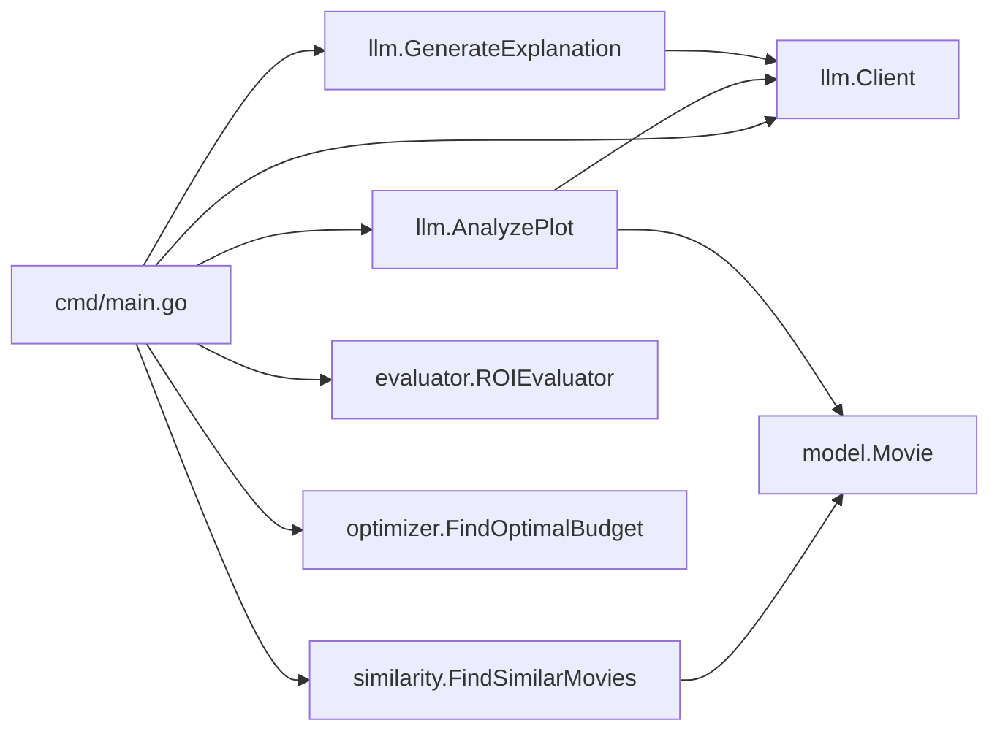

# Design Document: LLM Integration

## Overview

This design integrates ChatGPT into the Content Investment Simulator to replace keyword-based similarity matching with semantic plot analysis and to generate richer, LLM-powered explanations. Two new capabilities are introduced:

1. **Plot Analysis** — An LLM converts raw plot text into structured features (genre, themes, keywords), enabling the similarity engine to match on semantic meaning rather than raw word overlap.
2. **Explanation Generation** — An LLM produces natural-language reasoning for why historical movies were selected, replacing the current template-based explanation.

The LLM handles creative interpretation only. All financial modeling (ROI calculation, Monte Carlo simulation, budget optimization) remains deterministic and unchanged.

### Current vs. Target Pipeline

```mermaid
graph TD
    subgraph "Current Pipeline"
        A1[Plot Input] --> B1[Keyword Similarity]
        B1 --> C1[Similar Movies]
        C1 --> D1[Average ROI]
        D1 --> E1[Monte Carlo Simulation]
        E1 --> F1[Budget Optimizer]
        F1 --> G1[Template Explanation]
    end

    subgraph "Target Pipeline"
        A2[Plot Input] --> B2[LLM Plot Analyzer]
        B2 --> C2[PlotFeatures]
        C2 --> D2[Structured Similarity Engine]
        D2 --> E2[Similar Movies]
        E2 --> F2[Average ROI]
        F2 --> G2[Monte Carlo Simulation]
        G2 --> H2[Budget Optimizer]
        H2 --> I2[LLM Explanation Generator]
    end
```



## Architecture

The integration adds a new `internal/llm/` package containing three files:

```
internal/llm/
    client.go            # Reusable OpenAI ChatGPT HTTP client
    plot_analyzer.go     # Plot → PlotFeatures via LLM
    explanation.go       # Similar movies + context → natural language explanation
```

The existing `internal/similarity/` package is modified to accept `PlotFeatures` instead of raw plot strings. The existing `internal/explain/` package is no longer called from `cmd/main.go` — it is replaced by the LLM explanation generator.

### Dependency Flow



Key design decisions:
- **Single `Client` instance** shared across plot analyzer and explanation generator to avoid duplicate configuration.
- **`PlotFeatures` defined in `internal/llm/`** since it is an LLM-specific output structure. The similarity engine imports it.
- **Existing `internal/explain/` package preserved** but no longer wired into the main pipeline. This keeps backward compatibility if LLM is unavailable in the future.

## Components and Interfaces

### 1. `llm.Client` (`internal/llm/client.go`)

Reusable HTTP client for the OpenAI ChatGPT API.

```go
package llm

// Client communicates with the OpenAI ChatGPT API.
type Client struct {
    apiKey     string
    httpClient *http.Client
    model      string // e.g. "gpt-3.5-turbo"
    endpoint   string // "https://api.openai.com/v1/chat/completions"
}

// NewClient creates a Client by reading OPENAI_API_KEY from the environment.
// Returns an error if the key is not set.
func NewClient() (*Client, error)

// Chat sends a prompt to ChatGPT and returns the text response.
// Returns an error with HTTP status code and body on API failure.
func (c *Client) Chat(prompt string) (string, error)
```

### 2. `llm.PlotFeatures` and `llm.AnalyzePlot` (`internal/llm/plot_analyzer.go`)

```go
package llm

// PlotFeatures holds structured semantic metadata extracted from a movie plot.
type PlotFeatures struct {
    Genre    string   `json:"genre"`
    Themes   []string `json:"themes"`
    Keywords []string `json:"keywords"`
}

// AnalyzePlot sends the plot to ChatGPT with a structured prompt and parses
// the JSON response into PlotFeatures.
// Returns a parse error if the response is not valid JSON.
func AnalyzePlot(client *Client, plot string) (PlotFeatures, error)
```

### 3. `llm.GenerateExplanation` (`internal/llm/explanation.go`)

```go
package llm

// GenerateExplanation asks ChatGPT to explain why the similar movies
// were selected, focusing on narrative structure, themes, and genre.
// The avgROI is provided for context only — the prompt instructs the LLM
// not to compute financial values.
func GenerateExplanation(client *Client, plot string, similar []model.Movie, avgROI float64) (string, error)
```

### 4. Updated `similarity.FindSimilarMovies` (`internal/similarity/similarity.go`)

```go
// FindSimilarMovies scores movies against PlotFeatures using weighted matching:
//   genre match = +3, each theme match = +2, each keyword match = +1
// Returns up to 3 movies sorted by descending score.
// All comparisons are case-insensitive.
func FindSimilarMovies(features llm.PlotFeatures, movies []model.Movie) []model.Movie
```

### 5. Updated `cmd/main.go`

The main function changes to:
1. Initialize `llm.Client` (exit on failure)
2. Call `llm.AnalyzePlot` with the user's plot
3. Pass `PlotFeatures` to `similarity.FindSimilarMovies`
4. Use `llm.GenerateExplanation` instead of `explain.Generate`
5. Preserve existing output format

## Data Models

### PlotFeatures

| Field    | Type       | Description                                    |
|----------|------------|------------------------------------------------|
| Genre    | `string`   | Primary genre (e.g. "Action Thriller")         |
| Themes   | `[]string` | Narrative themes (e.g. ["revenge", "betrayal"])|
| Keywords | `[]string` | Descriptive keywords (e.g. ["assassin", "gang"])|

### Movie (existing, unchanged)

| Field   | Type      | Description                    |
|---------|-----------|--------------------------------|
| Title   | `string`  | Movie title                    |
| Genre   | `string`  | Genre category                 |
| Theme   | `string`  | Primary theme                  |
| Budget  | `float64` | Budget in millions             |
| Revenue | `float64` | Revenue in millions            |

### OpenAI API Request (internal to Client)

```json
{
  "model": "gpt-3.5-turbo",
  "messages": [
    {"role": "system", "content": "You are a movie analyst..."},
    {"role": "user", "content": "<prompt>"}
  ]
}
```

### OpenAI API Response (internal to Client)

```json
{
  "choices": [
    {
      "message": {
        "content": "<response text>"
      }
    }
  ]
}
```

### Scoring Model (Similarity Engine)

```
score = (genre_match * 3) + (theme_overlap_count * 2) + (keyword_overlap_count * 1)
```

Where:
- `genre_match` = 1 if `strings.EqualFold(movie.Genre, features.Genre)`, else 0
- `theme_overlap_count` = number of features.Themes that case-insensitively match `movie.Theme`
- `keyword_overlap_count` = number of features.Keywords that case-insensitively appear in `movie.Genre` or `movie.Theme`


## Correctness Properties

*A property is a characteristic or behavior that should hold true across all valid executions of a system — essentially, a formal statement about what the system should do. Properties serve as the bridge between human-readable specifications and machine-verifiable correctness guarantees.*

### Property 1: Client returns API response text

*For any* prompt string, when the OpenAI API returns a successful response, the `Client.Chat` method should return the text content from the first choice in the response body.

**Validates: Requirements 1.2**

### Property 2: Client error includes status and body

*For any* HTTP error status code (4xx or 5xx) and any response body returned by the OpenAI API, the error returned by `Client.Chat` should contain both the status code and the response body text.

**Validates: Requirements 1.4**

### Property 3: PlotFeatures JSON round-trip

*For any* valid `PlotFeatures` object (with a non-empty genre string, a themes array, and a keywords array), serializing it to JSON and then parsing that JSON back through the plot analyzer's parsing logic should produce an equivalent `PlotFeatures` value.

**Validates: Requirements 2.2**

### Property 4: Invalid JSON produces parse error

*For any* string that is not valid JSON (or valid JSON missing required fields), the plot analyzer's parsing logic should return a non-nil error.

**Validates: Requirements 2.4**

### Property 5: Plot analyzer propagates client errors

*For any* error returned by the `Client.Chat` method, calling `AnalyzePlot` should return that same error (or an error wrapping it) to the caller.

**Validates: Requirements 2.3**

### Property 6: Similarity scoring formula

*For any* `PlotFeatures` and any `Movie`, the similarity score should equal `3` if the genre matches (case-insensitive) plus `2` for each theme in `PlotFeatures.Themes` that matches the movie's theme (case-insensitive) plus `1` for each keyword in `PlotFeatures.Keywords` that matches the movie's genre or theme (case-insensitive).

**Validates: Requirements 3.2**

### Property 7: Similarity returns at most 3 results in descending score order

*For any* `PlotFeatures` and any slice of `Movie` records, `FindSimilarMovies` should return at most 3 movies, and the returned slice should be sorted by descending match score. Movies with a score of 0 should not appear in the results.

**Validates: Requirements 3.3, 3.4**

### Property 8: Case-insensitive matching

*For any* `PlotFeatures` and any `Movie`, changing the case of the genre, themes, or keywords in either the features or the movie should not change the computed similarity score.

**Validates: Requirements 3.5**

### Property 9: Explanation prompt contains all inputs

*For any* plot string, slice of similar movies, and average ROI value, the prompt constructed by `GenerateExplanation` should contain the plot text, each similar movie's title, and the average ROI value.

**Validates: Requirements 4.1**

### Property 10: Explanation generator propagates client errors

*For any* error returned by the `Client.Chat` method, calling `GenerateExplanation` should return that same error (or an error wrapping it) to the caller.

**Validates: Requirements 4.3**

## Error Handling

### LLM Client Errors

| Scenario | Behavior |
|----------|----------|
| `OPENAI_API_KEY` not set | `NewClient()` returns error: `"OPENAI_API_KEY environment variable is not set"` |
| HTTP error from API | `Chat()` returns error: `"ChatGPT API error (status %d): %s"` with status code and body |
| Network timeout/failure | `Chat()` returns the underlying `http.Client` error |

### Plot Analyzer Errors

| Scenario | Behavior |
|----------|----------|
| Client returns error | `AnalyzePlot()` propagates the error unchanged |
| Response is not valid JSON | `AnalyzePlot()` returns: `"failed to parse LLM response as JSON: %w"` |
| JSON missing required fields | Parsed `PlotFeatures` will have zero-value fields (empty string/nil slices); caller proceeds with reduced matching |

### Explanation Generator Errors

| Scenario | Behavior |
|----------|----------|
| Client returns error | `GenerateExplanation()` propagates the error unchanged |

### Pipeline Error Handling (`cmd/main.go`)

| Scenario | Behavior |
|----------|----------|
| `NewClient()` fails | Print error to stderr, `os.Exit(1)` |
| `AnalyzePlot()` fails | Print error to stderr, `os.Exit(1)` |
| `GenerateExplanation()` fails | Print error to stderr, `os.Exit(1)` |
| No similar movies found | Print message and exit gracefully (existing behavior) |

## Testing Strategy

### Dual Testing Approach

Both unit tests and property-based tests are used for comprehensive coverage.

- **Unit tests** verify specific examples, edge cases, and integration points.
- **Property-based tests** verify universal properties across randomly generated inputs.

### Property-Based Testing Library

Use [`pgregory.net/rapid`](https://github.com/flyentology/rapid) — a Go property-based testing library that integrates with `go test` and supports generators, shrinking, and minimum iteration configuration.

Each property test must run a minimum of **100 iterations**.

Each property test must be tagged with a comment referencing the design property:
```
// Feature: llm-integration, Property N: <property text>
```

Each correctness property is implemented by a single property-based test.

### Unit Test Coverage

| Area | Test Cases |
|------|------------|
| `llm.NewClient` | Missing API key returns error; valid key initializes client |
| `llm.AnalyzePlot` | Prompt contains JSON schema instructions; prompt contains plot text |
| `llm.GenerateExplanation` | Prompt contains narrative/theme focus instructions; prompt does not instruct financial computation |
| `cmd/main.go` | Client init failure exits with non-zero code; output contains expected section headers |
| `PlotFeatures` struct | No financial fields (genre, themes, keywords only) |

### Property Test Coverage

| Property | Test Description | Min Iterations |
|----------|-----------------|----------------|
| Property 1 | Mock HTTP server returns response; verify `Chat` returns text | 100 |
| Property 2 | Mock HTTP server returns error codes; verify error contains status + body | 100 |
| Property 3 | Generate random `PlotFeatures`, serialize to JSON, parse back, assert equality | 100 |
| Property 4 | Generate random non-JSON strings, attempt parse, assert error | 100 |
| Property 5 | Generate random errors, mock client to return them, verify propagation | 100 |
| Property 6 | Generate random `PlotFeatures` and `Movie`, compute expected score manually, compare | 100 |
| Property 7 | Generate random features and movie slices, verify result length ≤ 3 and descending order | 100 |
| Property 8 | Generate random features and movie, randomize case, verify score unchanged | 100 |
| Property 9 | Generate random plot/movies/ROI, verify prompt contains all inputs | 100 |
| Property 10 | Generate random errors, mock client, verify propagation from `GenerateExplanation` | 100 |

### Test File Organization

```
internal/llm/client_test.go          # Unit + property tests for Client
internal/llm/plot_analyzer_test.go    # Unit + property tests for AnalyzePlot
internal/llm/explanation_test.go      # Unit + property tests for GenerateExplanation
internal/similarity/similarity_test.go # Unit + property tests for updated FindSimilarMovies
```
